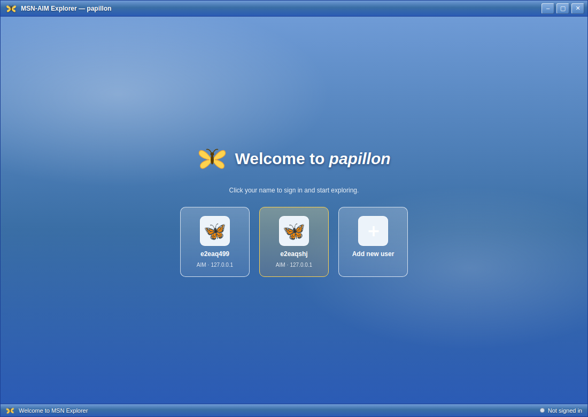

# MSN-AIM Explorer (“papillon”) 🦋

A faithful recreation of **MSN Explorer** — the 2000-era all-in-one online client — that
runs on today's operating systems and today's internet, with one twist: the instant
messenger speaks **AIM** over the real **OSCAR protocol** (with MSN Messenger via
Escargot designed in as protocol #2).



Everything lives in one skinned shell, just like the original: a working web browser,
your buddy list, e-mail, a music player, and an MSN-portal-style home page with live
headlines and weather.

## What works today

- **AIM over OSCAR, implemented from scratch in TypeScript** (no client library for
  this protocol has been maintained in ~15 years): BUCP MD5 sign-on, server-side buddy
  lists (Feedbag) with groups and transactional add/remove, presence
  (online/away/idle), away messages with auto-responses, instant messages with correct
  classic charsets (ASCII/ISO-8859-1/UCS-2BE — emoji round-trip fine), typing
  notifications, offline messages, server rate-limit compliance, reconnect with backoff.
- **Works against real servers**: a local [Open OSCAR
  Server](https://github.com/mk6i/open-oscar-server) for development (docker compose or
  `scripts/run-oscar-server.sh`), or the public [NINA](https://nina.chat) AIM revival
  network (`login.oscar.nina.chat:5190`) — both are sign-in presets.
- **The shell**: per-user sign-in tiles, blue-gradient chrome with a hand-drawn
  butterfly, sidebar buddy list with live presence, AIM-style chat windows (red/blue
  senders, typing indicator, B/I/U formatting), an embedded real browser
  (`WebContentsView`), IMAP/SMTP e-mail, a WMP-style music player with visualizer, and
  a news/weather home page.
- **MSN Messenger**: interface stub + full design doc ([docs/MSNP-PLANNING.md](docs/MSNP-PLANNING.md))
  targeting the Escargot revival service.

## Quick start

```bash
pnpm install

# 1. start a local AIM server (pick one)
pnpm dev:server                 # docker compose (Open OSCAR Server)
./scripts/run-oscar-server.sh   # …or build & run it from source via Go

# 2. run the app
pnpm dev
```

Click **Add new user**, pick any screen name and password (the dev server auto-creates
accounts), and you're online. Run a second copy with a second screen name to chat with
yourself across two buddy lists — presence, messages, and typing indicators all flow
through the real OSCAR server.

To join the public AIM revival community instead, choose the **NINA** preset at sign-in
(register your screen name at nina.chat first).

## Development

```bash
pnpm typecheck            # strict TS across all packages
pnpm test                 # 30 unit tests incl. a scripted fake OSCAR server
pnpm test:integration     # end-to-end against a real local OSCAR server
pnpm build                # bundle main/preload/renderers
pnpm exec playwright test # E2E: boots the app, signs on, switches panes
pnpm dist                 # installers via electron-builder
```

Repo layout, process/IPC rules, and testing layers: [docs/ARCHITECTURE.md](docs/ARCHITECTURE.md).
OSCAR wire-format crib sheet: [docs/OSCAR-NOTES.md](docs/OSCAR-NOTES.md).

## Legal

This is a stylistic homage, not a copy: all artwork (butterfly, icons, skin) is original
SVG/CSS drawn for this project. No Microsoft or AOL assets, names, or binaries are
included. MSN and AIM are trademarks of their respective owners; this project is not
affiliated with or endorsed by Microsoft or Yahoo/AOL.
